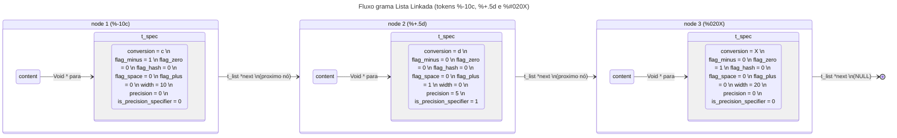

# ft_printf

O `ft_printf` é uma implementação personalizada da função `printf` da biblioteca padrão do C. Este projeto foi desenvolvido como parte da formação na 42 e possui tanto a parte obrigatória quanto os bônus, garantindo a máxima pontuação na avaliação pela moulinette.

## Objetivo do Projeto

### Parte Mandatória
- **Nome do programa:** `libftprintf.a`
- **Arquivos para entregar:** `Makefile`, `*.h`, `*/*.h`, `*.c`, `*/*.c`
- **Funções externas autorizadas:**
  - `malloc`, `free`, `write`, `va_start`, `va_arg`, `va_copy`, `va_end`
- **Libft autorizado:** Sim
- **Descrição:**
  - Escreva uma biblioteca que contenha a função `ft_printf()`, imitando o comportamento do `printf()` original da biblioteca padrão do C.
  - O protótipo da função é: `int ft_printf(const char *, ...);`
  - A função deve lidar com as seguintes conversões: `c`, `s`, `p`, `d`, `i`, `u`, `x`, `X`, `%`.

### Parte Bônus
- Gerencie combinações de flags: `'-0.'` e a largura mínima do campo em todas as conversões.
- Gerencie flags adicionais: `'# +'` (incluindo o espaço como flag).

## Funcionalidades

### Conversões Implementadas
- `%c`: Imprime um único caractere.
- `%s`: Imprime uma string.
- `%p`: Imprime o endereço de um ponteiro no formato hexadecimal.
- `%d` / `%i`: Imprime um número decimal (base 10).
- `%u`: Imprime um número decimal sem sinal.
- `%x` / `%X`: Imprime um número em formato hexadecimal (base 16, minúsculas/maiúsculas).
- `%%`: Imprime um sinal de porcentagem.

### Flags Implementadas
- `-`: Alinhamento à esquerda.
- `0`: Preenchimento com zeros.
- `.`: Precisão de saída.
- `#`: Formatação alternativa (e.g., `0x` para hexadecimais).
- `+`: Sinal explícito para números positivos.
- Espaço: Adiciona um espaço antes de números positivos.

## Tecnologias Utilizadas
- Linguagem: C
- Estruturas: Listas encadeadas utilizando `t_list` da `libft`
- Funções externas: `malloc`, `free`, `write`, `va_start`, `va_arg`, `va_copy`, `va_end`
- Biblioteca: `libft` integrada

## 📁 Estrutura do Projeto
```bash
ft_printf/
├── bin/          # Binários gerados (opcional)
├── include/      # Cabeçalhos (.h) do projeto
├── libft/        # Biblioteca libft
├── obj/          # Arquivos .o gerados na compilação
├── src/          # Arquivos .c do ft_printf
├── tests/        # Testes pessoais
├── Makefile      # Automação da compilação
├── README.md     # Documentação do projeto
```
### 🔑 Benefícios
- **Separação de responsabilidades:** Código principal, dependências e compilados organizados em pastas específicas.
- **Facilidade de navegação:** Estrutura modular para manutenção e expansão.
## Makefile
### Regras
- **Targets:** `NAME`, `all`, `clean`, `fclean`, `re`, `bonus(se ouver)`
  - Como a parte mandátoria ja incluia o bonus(recomendação do subject) a target bonus simplesmente chama a all, não alterei nenhum arquivo para colocar o \_bonus dito pelo subject, não tive problemas com isso nas avaliações muito menos na moulinette.
- **Libft:** Se a `libft` estiver incluida, o makefile deve compilar a libft com o make dela e depois compilar o `libftprint.a`
  - **Passo 1: Compilar a libft com o makefile dela** 
    - para fazer isso é necessário usar a tag -C na libft_dir, o -C especifica o diretório onde o `MAKE` será feito:
      ```Makefile
      $(LIBFT):
            $(MAKE) -C $(LIBFT_DIR)
      ```
  - **Passo 2: Incluir os arquivos .o da libft na libftprintf.a** 
    - Há duas maneiras de fazer isso:
      ```Makefile
      # maneira direta
      $(NAME): $(OBJS) $(LIBFT)
            ar rcs $(NAME) $(OBJS) $(LIBFT_DIR)/*.o
      # $(OBJS): arquivos .o gerados a partir do /src da ft_printf.
      # $(LIBFT_DIR)*.o: todos os arquivos .o da pasta /libft.
      ```
      ```Makefile
      # maneira elegante
      $(NAME): $(OBJS) $(LIBFT)
            @cp $(LIBFT) $(NAME)
            ar rcs $(NAME) $(OBJS)
      # @cp $(LIBFT) $(NAME): Copia a libft.a para a raiz do repositório
      # ar rcs $(NAME) $(OBJS): Depois adiciona os objs do src ao $(NAME) agora ja com os objs da libft.
      ```
### Makefile completo
```Makefile
NAME = libftprintf.a
# compilador e flags    
CC = cc  
CFLAGS = -Wall -Wextra -Werror -Iinclude 
# dirs  
LIBFT_DIR = libft 
SRC_DIR = src  
OBJ_DIR = obj 
APPS_DIR = apps 
BIN_DIR = bin 
#files 
SRCS = $(SRC_DIR)/free_specifiers.c $(SRC_DIR)/ft_printf.c $(SRC_DIR)/parse_format.c $(SRC_DIR)/parse_utils.c \  
        $(SRC_DIR)/print_format.c $(SRC_DIR)/print_format_utils.c $(SRC_DIR)/printf_i_d_u.c $(SRC_DIR)/printf_i_d_u_utils.c \ 
        $(SRC_DIR)/printf_p_x.c $(SRC_DIR)/printf_p_x_utils.c $(SRC_DIR)/printf_s_c_percent.c  
OBJS = $(SRCS:$(SRC_DIR)/%.c=$(OBJ_DIR)/%.o) 
LIBFT = $(LIBFT_DIR)/libft.a 

# Mandatório   
all: $(LIBFT) $(NAME) 

$(LIBFT):  
        $(MAKE) -C $(LIBFT_DIR) 

$(NAME): $(OBJS) $(LIBFT)   
        @cp $(LIBFT) $(NAME) 
        ar rcs $(NAME) $(OBJS) 
        # ar rcs $(NAME) $(OBJS) $(LIBFT_DIR)/*.o  

$(OBJ_DIR)/%.o: $(SRC_DIR)/%.c    
        @mkdir -p $(OBJ_DIR)
        $(CC) $(CFLAGS) -g -c $< -o $@  

clean: 
        rm -rf $(OBJ_DIR)/*.o 
        $(MAKE) clean -C $(LIBFT_DIR)

fclean: clean  
        rm -f $(NAME) $(LIBFT) 

re: fclean all  
```

## Explicação
O `ft_printf` processa uma string de entrada com especificadores (%) e gera uma saída formatada. Sua execução ocorre em três etapas principais:

### 1️⃣ Parsing do Formato
- Identifica os especificadores de conversão na string (`%`).
- Cria uma lista ligada com nós que armazenam uma estrutura `t_spec`.
  - `t_spec`: Contém informações detalhadas sobre os especificadores.
  ```c
    typedef struct s_specifier
    {
        char    conversion;              // Tipo de conversão: c, s, p, etc.
        int     flag_minus;              // Flag '-' (alinhamento à esquerda)
        int     flag_zero;               // Flag '0' (preenchimento com zeros)
        int     flag_hash;               // Flag '#' (formato alternativo)
        int     flag_space;              // Flag ' ' (espaço para números positivos)
        int     flag_plus;               // Flag '+' (sinal explícito para números positivos)
        int     width;                   // Largura mínima
        int     precision;               // Precisão
        int     is_precision_specified;  // Flag para precisão especificada
    }       t_spec;
  ```

### 2️⃣ Processamento e Impressão
- Para cada nó da lista ligada:
  - A lista utiliza a estrutura `t_list`, fornecida pela `libft`:
  ```c
    typedef struct s_list
    {
        void            *content;  // Aponta para um t_spec
        struct s_list   *next;     // Próximo nó na lista
    }       t_list;
  ```
  - Cada nó (`t_list`) contém um ponteiro para uma instância de `t_spec` que define o comportamento do especificador correspondente.

### 3️⃣ Liberação de Memória
- Todos os nós e estruturas associadas são liberados após o processamento, garantindo segurança de memória.
### 📂 Ciclo de Funções
| Função | Descrição |
| ------ | --------- |
| `parse format` | as funções _`parse`_ analisa a string `format` e cria lista linkada |
| `print format` | Processa e imprime o `format` utilizando a lista linkada como apoio |
| `free specifiers` | Libera a memória alocada para os tokens |

### ft_printf
```c
#include "../include/ft_printf.h"

int     ft_printf(const char *format, ...)
{
        t_list  *lst_tokens;
        va_list args;
        int             length;

        length = 0;
        va_start(args, format);
        lst_tokens = NULL;
        parse_format(format, &lst_tokens);
        length += print_format(format, lst_tokens, args);
        free_specifiers(lst_tokens);
        va_end(args);
        return (length);
}
```

### 📊 Fluxograma da Lista Linkada


## Instalação

1. Clone o repositório:
   ```bash
   git clone https://github.com/seu_usuario/ft_printf.git
   ```
2. Compile o projeto:
   ```bash
   make
   ```
3. Inclua a biblioteca no seu projeto:
   ```c
   #include "ft_printf.h"
   ```

## Uso

```c
#include "ft_printf.h"

int main()
{
    ft_printf("Caractere: %c\n", 'A');
    ft_printf("String: %s\n", "Hello, world!");
    ft_printf("Ponteiro: %p\n", (void *)42);
    ft_printf("Decimal: %d\n", 12345);
    ft_printf("Hexadecimal: %x\n", 255);
    ft_printf("Porcentagem: %%\n");
    return 0;
}
```

<!---->
